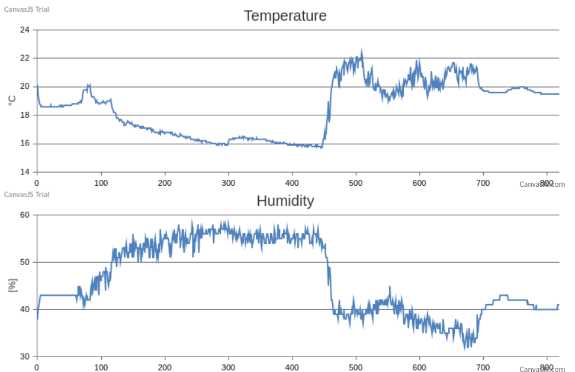

# HumidityAndTemperatureForSmartHome

Simple solution to track humidity and temperature of your home with an Arduino and a MySQL Database. 

The Arduino uses a DHT11 sensor. In case of another sensor, a different library needs to be included in the .ino Code. 

Furthermore a RasperryPi is used as a Server to run the script Index.php, which reads the data from the database and 
visualize it on the local intranet page of your Pi. The webpage shows a graph of the humidity and temperature course:

